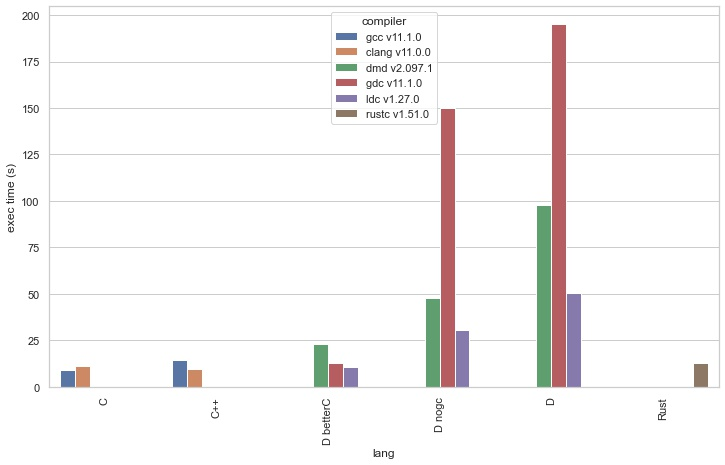

# Fisher's Exact Test (FET) Benchmark

## Table of Contents
1. Preface
2. Introduction
3. Methodology and Tooling
4. Benchmark results
5. Conclusion
6. Suggestions, questions and improvement proposals

## Preface

Dear reader, before moving onto the details of this benchmark, I'd like to point out a few things. 

Firstly, I have never done any benchmarks before. I tried my best to study the topic. However, my knowledge is most likely incomplete and lacking. If you find any discreptancies, errors in the procedure below, or if you have any improvement suggestions, feel free to reach out to me either via creating an issue on github or writing to my email directly. 

Secondly, I am no expert on all languages presented in this benchmark. Therefore, if you have better code solutions, feel free to submit them as well. I will review them as soon as possible. 

Finally, if you would like to suggest a new topic for future benchmarks, submit them as well through the means listed above. Please, read this submition [guideline](../Topic%20submission%20guideline.md). 

## Introduction

The purpose of this benchmark is to find how quickly various compiled programming languages are able to perform compared to Python and R library implementations. In other words, Python and R will not implement the algorithms themselves, but will use algorithms that are already implemented in available stats packages, be it C code that is called from Python/R or a direct Python/R implementation. 

The reason such a "strange" strategy is chosen is to examine whether the performance gains achieved by rewriting the Python/R code in a compiled language is worth the time and effort required for such a task. In addition, I'm just curious what would be the results, what language attains the best result. 

This is by no means a language comparison. And it's hardly viable to judge language performance by a single test. Therefore, I suggest you to study the topic more broadly using all available internet resources to come to your own conclusions. 

In this particular benchmark the Fisher's Exact test is used to measure language performance. You can read more about this test [here](https://www.omnicalculator.com/statistics/fishers-exact-test). From now on I will refer to Fisher's Exact test as FET.

The following benchmark criteria are examined:
1. execution time (sec)
2. memory consumption (kb)
3. binary size (kb)
4. conciseness of a programming language (lines of code)

The list of programming languages tested:
* C
```
GCC     v11.1.0
Clang   v11.0.0

flags:  -O3 -std=c11
```
* C++
```
GCC     v11.1.0
Clang   v11.0.0

flags:  -O3 -std=c++11
```
* D
```
DMD     v2.097.1
GDC     v11.1.0
LDC     v1.27.0
flags:  dmd : -O -release -inline -boundscheck=off (-betterC)
        gdc : -O3 -frelease -fbounds-check=off (-fno-druntime)
        ldc : -O3 --release --boundscheck=off (--betterC)
```
* Rust
```
cargo   v1.51.0
rustc   v1.51.0
flags:  --release
```
* Python v3.9.6
* R v4.1.0

The benchmarks are be carried out on a MacBook Pro 2015 with 2.9 GHz Intel Core i5, 8 GB of ram and macOS Mojave v10.14.6. 

## Methodology and Tooling

For C, C++ and D I wrote my own FET implementation, other languages used their library implementations. In particular, since I'm not very well familiar with Rust, I used the `fisher_exact` crate that can be found [here](https://github.com/cpearce/fishers_exact), Python - scipy package, R - built-in.

All applications were shutdown before running the benchmark, except for the `Terminal` that was used to measure execution time with the `time` utility, and `Activity Monitor` that was used to measure memory consumption. 

Finally, the FET test was run in a loop 100'000 times.

Table values used in the test:
1982 | 3018
--- | ---
2056 | 2944

## Benchmark results

Plots are available down below. Here is a table with the results:
lang|compiler|exec time (s)|mem consump (kb)|bin size (kb)|loc
--- | --- | --- | --- | --- | --- 
C|gcc v11.1.0|9.2|340|8.8|83
C|clang v11.0.0|11.3|900|8.8|83
C++|gcc v11.1.0|46.8|1500|15|84
C++|clang v11.0.0|11.7|832|15.9|84
D|dmd v2.097.1|97.6|2000|1270|81
D|gdc v11.1.0|195|2300|229.4|81
D|ldc v1.27.0|50.4|5000|6175|81
Rust|cargo (rustc) v1.51.0|13|264|459.8|118
Python|v3.9.6|466.5|35300|0|22
R |v4.1.0|481.82|48500|0|18
D nogc|dmd v2.097.1|48|460|829.8|86
D nogc|gdc v11.1.0|150.2|968|95.7|86
D nogc|ldc v1.27.0|30.8|636|6155|86
D betterC|dmd v2.097.1|23.2|340|10.2|88
D betterC|gdc v11.1.0|12.9|360|10.4|88
D betterC|ldc v1.27.0|10.4|340|14|88

### 1. execution time (sec)
<center></center>

C, Rust and D in betterC mode were the fastest, as well as C++ compiled with clang. 

GCC C++ was twice as slow. Although, I'm quite sure, had I rewritten the code without `std::vector`, the performance would have been the same as with Clang binary. 

D code compiled with GDC turned out to be the slowest, whereas LDC produced the fastest executable every time. DMD, on the other hand, turned out to be somewhere in the middle. 

For Python and R it took approximately 8 minutes to run 100'000 FET tests. My expectations were around 15-20 minutes though. 

### 2. memory consumption (kb)
<center></center>

Let's start with D this time. We have seen that LDC produced the fastest executable, but when it comes to memory consumption, its binary consumes the largest amount of memory among all languages when using GC (which is how you would normally use D). 

D in betterC mode was in par with C and Rust followed by C++ irrespective of what compiler is used.

Strangely though, C compiled with GCC consumed twice as less memory than the binary produced by Clang. The same situation can be observed with C++, but reversed. I am not a compiler expert, so I won't guess what might be the reason.

### 3. binary size (kb)
<center></center>
 
 C, C++ and D in betterC mode have the smallest binaries. Rust is somewhere in the middle with ~400kb. D compiled with LDC produced the largest binaries of ~6Mb.
 
### 4. conciseness of a programming language (lines of code)
Every FET implementation was approximately the same. Python and R had ~20 loc, excluding library implementation. 

# Conclusion

Before drawing my own conclusion from the results above, I'd like first to restate what was mentioned earlier: it's hardly viable to judge a language by a single test. The results vary, and it all depends on what you want to achive. 

In this particular example, the performance gains aren't that significant to motivate me to rewrite my Python/R code in a compiled language. Python executed the code in ~8 minutes, and it took me approximately the same amount of time to implement the Fisher's Exact test myself. Nonetheless, we should not forget the fact that it's a single test and it hardly describes the real world. 

I was doing machine learning project once and experienced long wait times before I could examine the results. Of course, there are ways to make it faster, but it's a different topic. This was what motivated me to take a look at the compiled languages and experiment with what they can offer in terms of performance. Python/R is a great choice, but if you are working from a laptop, they might be slow sometimes. 

If I had to rewrite some of my Python/R code in a compiled language I would go for C++ or D. D offers a more pleasant syntax that I can intuitevely understand. C++ has many great libraries and frameworks readily available. Personally, I prefer the former for the following reasons:

D has it's own 'interpreter' called `rdmd`. Although, it just invokes the compiler, but it's fast and does indeed feel like an interpreter. Thus, your D code can be run as a script, the same as you would do with Python;

D has a nice package manager called DUB. It manages my code and external dependencies without involving me in the process.

The reason I wouldn't go for Rust is simply because I'm not very well familiar with the language. I tried it many times, but it's syntax and the way it makes you think is something one must adapt to before becoming proficient in the language.

That's it for this benchmark. 

## Suggestions, questions and improvement proposals

If you have any questions, suggestions and/or imporovement proposals feel free to create an issue or contact me via my email: rill.ki@yahoo.com 

If you would like to propose a future benchmark topic, then check out the topic submission [guideline](../Topic%20submission%20guideline.md).


