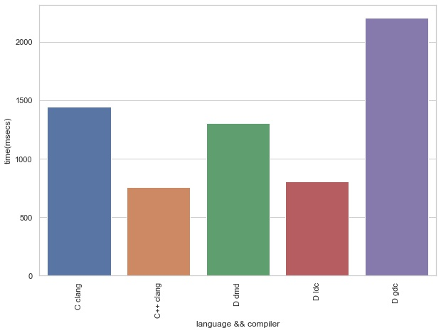

# Standard library sort function performance test
---
### Introduction
The aim here is to test the C, C++, D standard library implementations of `sort` function and to measure its performance. The data of 10 000 000 integers was randomly generated, then sorted. The time that it took to generate the data was not included.

This benchmark was carried out on a MacBook Pro 2015 with 2.9 GHz Intel Core i5, 8 GB of ram and macOS Mojave v10.14.6.

Compilers used:
* C
```
Clang   v11.0.0
flags:  -O3 -std=c11
```
* C++
```
Clang   v11.0.0
flags:  -O3 -std=c++17
```
* D
```
DMD     v2.097.1
GDC     v11.1.0
LDC     v1.27.0
flags:  dmd : -O -release -inline -boundscheck=off
		gdc : -O3 -frelease -fbounds-check=off
		ldc : -O3 --release --boundscheck=off
```

### Results
Here is a table with the results:

language|compiler|function|time(msecs)
--- | --- | --- | ---
C|clang|qsort|1442
C++|clang|std::sort|754
D|dmd|std.algorithm: sort|1305
D|ldc|std.algorithm: sort|805
D|gdc|std.algorithm: sort|2207

Execution time by language plot:
<center></center>

---

The C standard library `qsort` function took 1.4 secs to sort 1 million integers. Whereas the C++ `std::sort` version was twice as fast at 0.7 secs. I believe this is due to the fact that C++ compiler can effectively inline functions, thus, improving the performance. The C `cmp` compare function wasn't inlined.

C++17 makes it also possible to parallelize this process using `std::sort(std::execution::par, ...)`, which should increase the performance even further. But I wasn't able to make work on my MacBook, so I did not test it  here.

Now, onto D. The DMD compiler optimizations are great. It was faster than the C version. But the clear winner is the LDC compiler, which produces the best optimized binary that was almost as fast as the C++ version.

Hence, C++ and D are the winners.
